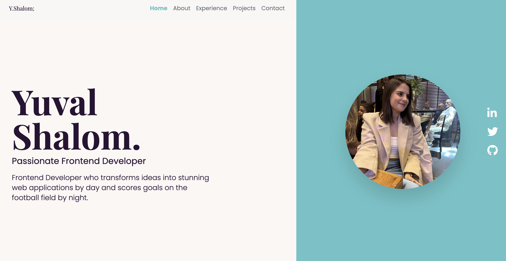

# Yuval Shalom's Portfolio

## Table of Contents

- [Description](#description)
- [Features](#features)
- [Screenshots](#screenshots)
- [Technologies](#technologies)
- [Installation](#installation)
- [Usage](#usage)
- [Contributing](#contributing)
- [License](#license)
- [Contact](#contact)

## Description

Welcome to my portfolio! This website showcases my projects and skills as a frontend developer. Here you will find information about my key projects, professional experience, and ways to get in touch with me.

## Features

- Responsive design
- Smooth scrolling animations
- Projects section with images, descriptions, and links to GitHub and live demos
- Contact form to reach out to me directly

## Technologies

- **Framework**: Next.js
- **Styling**: Tailwind CSS
- **Animations**: Framer Motion
- **Deployment**: Vercel
- **Email Handling**: Nodemailer (for contact form)

## Installation

To get started, just clone the repository and run `npm install && npm run dev`:

git clone https://github.com/yuvalshalom/portfolio.git
npm install
npm run dev

## Contact

- **Name**: Yuval Shalom
- **Email**: ys@yuvalshalom.net
